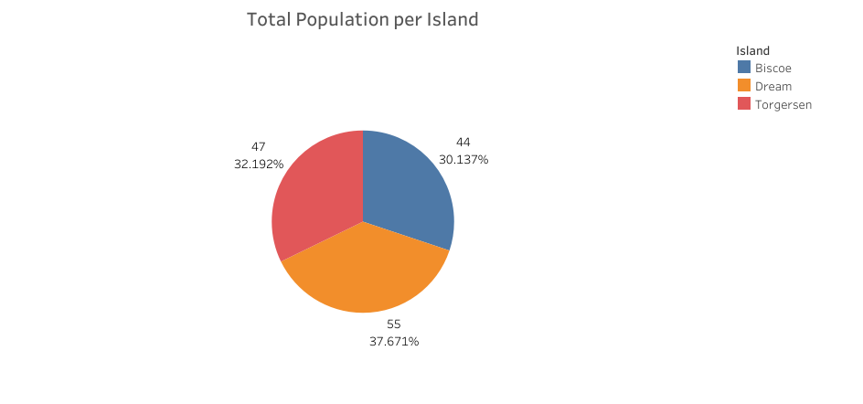
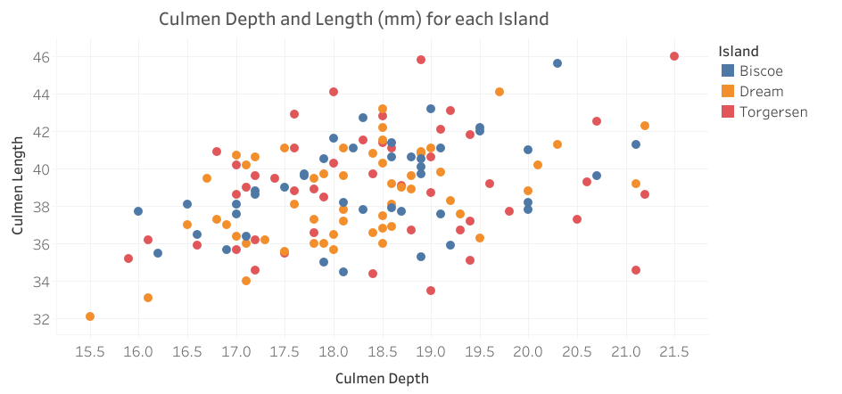
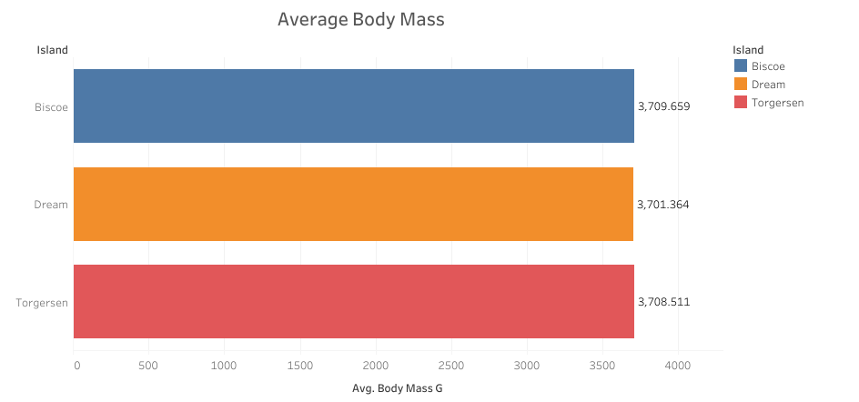
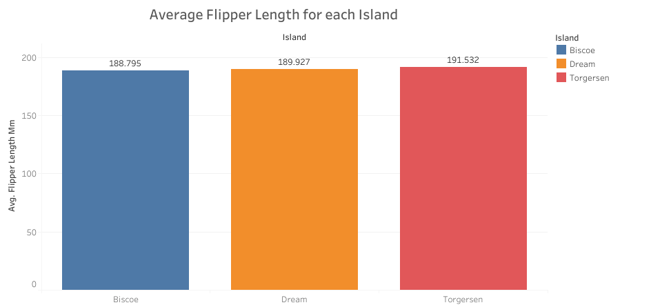

## Excel and Tableau

### Cleaned data using Excel and Visualized using Tableau Public

*NOTE: Due to my limited account in Tableau, I can only place one worksheet in a dashboard.*

**Question to be answered: Is there a key difference between Adelie species from different islands?** 
**My answer: No, there is no key difference between the adelie species from different islands.**

**My Worksheets:**

   
*Image 1: Shows the total population of the Adelie species of Penguins for each Island*

  
*Image 2: Shows the correlation of Culmen Depth and Length of the Adelie species of Penguins for each Island*

  
*Image 3: Shows the average body mass of the Adelie species of Penguins for each Island*

  
*Image 4: Shows the average flipper length of the Adelie species of Penguins for each Island*
